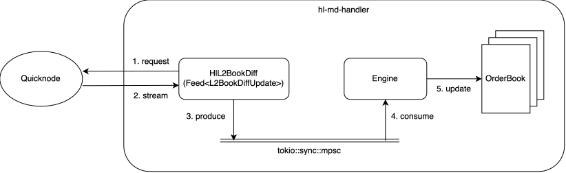
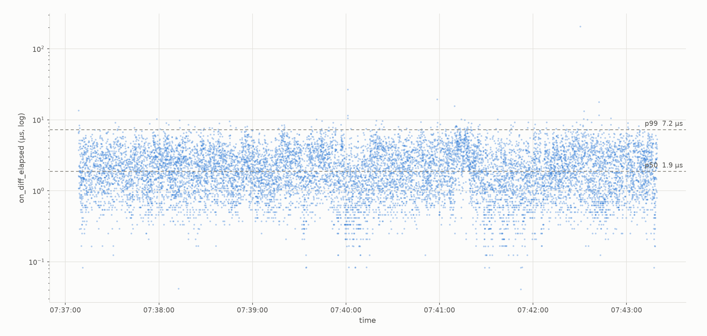

# hl-md-handler
A L2 orderbook data handler for Hyperliquid DEX using Quicknode's gRPC API

### Features & Design Choices
- Processes top 20 levels of orderbook data for multiple perpetual symbols
- Uses `Tokio` and `Tonic` for async runtime and gRPC implementation
- Uses `tokio::sync::mpsc` as the queue between producer (Feed) and consumer (Engine)
- Uses `tracing-appender` for non-blocking logging
- Connects to Quicknode's Hyperliquid API, requiring gRPC endpoint and auth token (a temporary set can be provided)
- Book levels are processed in fixed-size, sorted arrays. Uses linear search for level searching favoring top levels, and `copy_within()` for updating levels in place
- [Faster parsing](#benchmarks) from decimal string to `u64`

### Quickstart
Configuration: Put the gRPC endpoint, auth token, and perp symbols to subscribe in `config/config.toml`

At the project root:
```
$ cargo run --release
```

### Architecture


### Latency Measurement


### Benchmarks
A simple benchmark using Criterion for `Engine::parse_to_u64_with_mul()`, with `s.parse::<f64>() as u64` and `rust_decimal` as baselines:
```
parse_str_to_u64/engine_parse/123.456       time:   [2.4227 ns 2.4547 ns 2.4972 ns]
parse_str_to_u64/f64_parse/123.456          time:   [7.4213 ns 7.4233 ns 7.4261 ns]
parse_str_to_u64/decimal_parse/123.456      time:   [20.967 ns 21.087 ns 21.205 ns]

parse_str_to_u64/engine_parse/123           time:   [1.5904 ns 1.5908 ns 1.5914 ns]
parse_str_to_u64/f64_parse/123              time:   [4.7720 ns 4.7765 ns 4.7825 ns]
parse_str_to_u64/decimal_parse/123          time:   [11.491 ns 11.552 ns 11.611 ns]

parse_str_to_u64/engine_parse/123456.7      time:   [2.9157 ns 2.9171 ns 2.9188 ns]
parse_str_to_u64/f64_parse/123456.7         time:   [7.4221 ns 7.4282 ns 7.4375 ns]
parse_str_to_u64/decimal_parse/123456.7     time:   [20.727 ns 20.840 ns 20.945 ns]
```

### Limitations
- Support perpetuals only
- No. of book levels (20) is not configurable

### Potential Improvements
- Book staleness check against RESTful
- Support multiple exchanges using the Feed trait
- Write to shared memory for IPC with actual clients
- Resubscription logic
- ...

This repository is for learning purpose only
